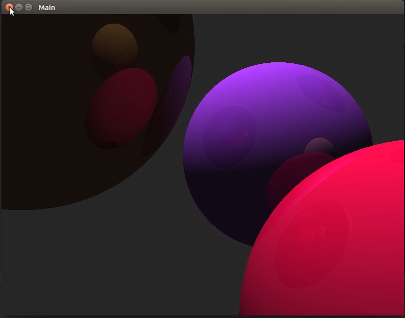

# Raytracer demo - written in Kotlin



This is a real time raytracer (real time as long as your CPUs can keep up)

It renders in parallel taking advantage of multiple CPUs, dividing up the work into horizontal lines.

The renders from the ray tracer are written to a texture which is then displayed as a Sprite in an OpenGL window using libGDX

# Youtube video
You can see a youtube video of the raytracer in action here:
[Video link](https://www.youtube.com/watch?v=j2QW-z3Ahbw)

# How to run
```
./gradlew desktop:run
```

# Controls

W, A, S, D, Q, E - movement
Escape - quit

# Other

This is my attempt at creating a ray tracer by following some other examples online.  There are likely some things I did wrong.
